# Multi-Robot Warehouse — 4 Unitree G1 Humanoids, Collaborative Search-and-Fetch

Four named **Unitree G1 humanoids** — **Alpha, Bravo, Charlie, Delta** — explore a
**multi-room** warehouse whose shelves, dividers and open doorways hide every object
from any single viewpoint. Give a robot a job in plain English ("*Alpha, fetch the
red cube to the delivery pad*") and it runs the whole collaboration itself: it checks
its own view, **addresses** teammates to ask what they can see, **delegates** a
room-by-room search when nobody can, receives the location as a **relative-position
report** over a **need-to-know** message bus, plans the **shortest collision-free
A\*** route, **walks it on a learned VLA locomotion policy**, picks up the object
and delivers it — reporting milestones back to whoever asked, and to no one else.
A fleet-addressed order ("*someone bring the object to the destination*") is instead
routed by an **allocator** that picks the robot with the objectively shortest path.

> **What is actually learned here.** Locomotion and object grounding are **learned
> models fine-tuned in this repo**: a distilled GroundedNav **VLA walk policy** (F5)
> and a warehouse-domain **GROUND_NET** detector. The Unitree **whole-body controller
> (WBC) is used only for data collection and standing balance** — in the demos the
> robots *walk* on the trained policy. Coordination, planning, addressed comms and the
> mock pickup are engineered systems, called out plainly in
> [Honest assumptions](#honest-assumptions).

This builds on the single-robot [G1Nav baseline](https://github.com/KiwooShin/VLA_mujoco_unitree)
(distilled walk policy, learned grounding, two-camera perception) and adds the
warehouse, the multi-room layout, the A\* planner, the fleet co-simulation, the
addressed-comms + mission layer, and **two in-repo domain fine-tunes**.

### Collaborative fetch, end to end (multi-room, full learned stack)


<sub>The requested cube is hidden in **storage A**, out of every robot's initial
sightline, so **Alpha delegates**: Bravo/Charlie/Delta search storage A / back room /
storage B, routing through the doorways. Bravo finds it and reports **its position
relative to itself** (F3) **to Alpha only**; a target ring then appears **at the
reported spot** (F2) and the GROUND_NET heatmap inset confirms it. Alpha stands the
others down, walks the learned VLA gait to fetch it, and carries it to the pad. The
right panel is the **live comms transcript** (coloured per speaker) plus the
**communicating robots' ego insets** (F1). (GitHub can't autoplay committed MP4s —
this is a compressed clip of the flagship video below.)</sub>

## Demo gallery

Click a poster to play the MP4 (`assets/gallery/`). These four **final** clips run in
the multi-room layout on the full learned stack (VLA locomotion + fine-tuned detector).

| | |
|---|---|
| [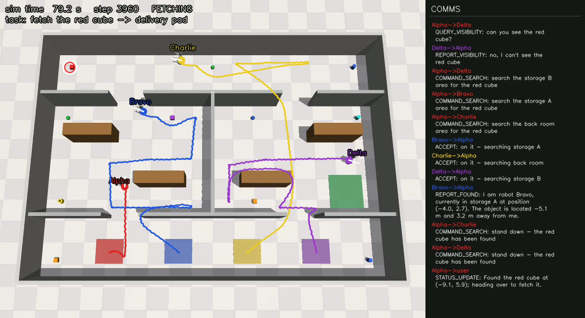](assets/gallery/final_mission_c.mp4) | [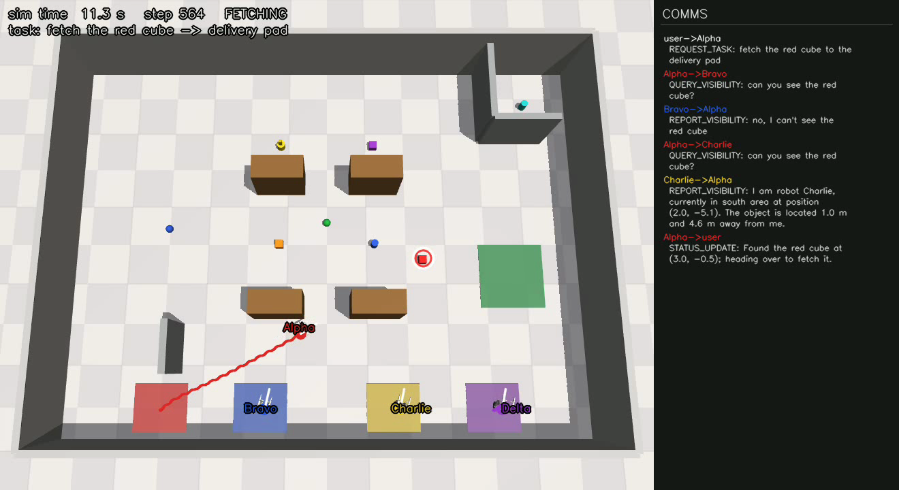](assets/gallery/final_scenario_b.mp4) |
| **Collaborative search & fetch** (C) — object hidden from all; delegated room-to-room search through doorways, finder reports a **relative position** to the owner, owner delivers. | **Peer visibility handoff** (B) — only a teammate can see the object; addressed query → the peer reports the object's position **relative to itself** → owner fetches. |
| [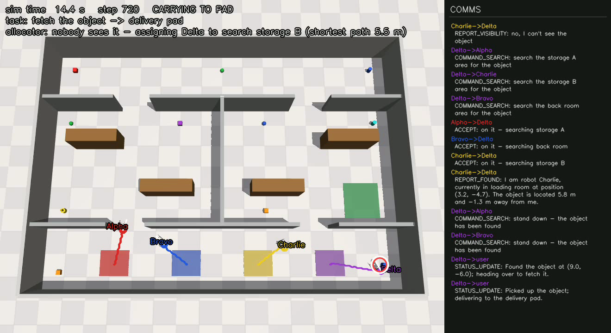](assets/gallery/final_generic.mp4) | [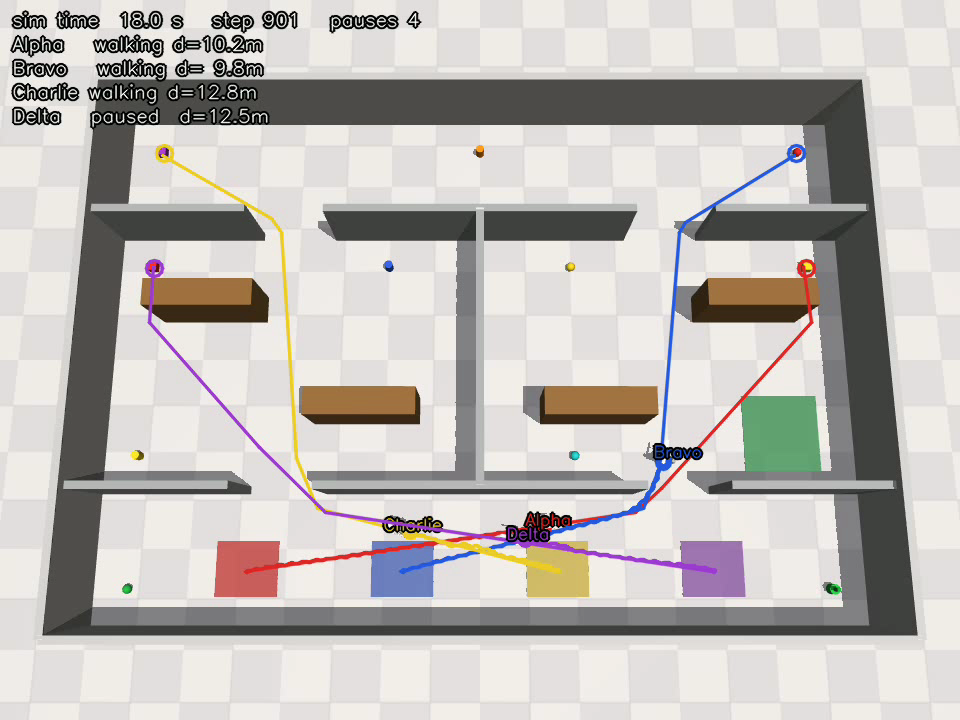](assets/gallery/final_fleet_nav.mp4) |
| **Fleet-addressed command** (F4) — a minimal generic order (*"bring the object"* — no name, no colour); the resolver + allocator assign optimally and the first finder wins. | **Fleet navigation (VLA)** — four robots cross shared aisles and rooms simultaneously on the learned gait, each on its own A\* route, with mutual-proximity pauses; zero falls. |

**One-file reel** (all four final segments behind title cards):
[`assets/gallery/hero_reel.mp4`](assets/gallery/hero_reel.mp4).

**Scales past four robots** — same abstractions, six named robots (Alpha…Foxtrot) in a
24×16 m four-room hall:

| | |
|---|---|
| [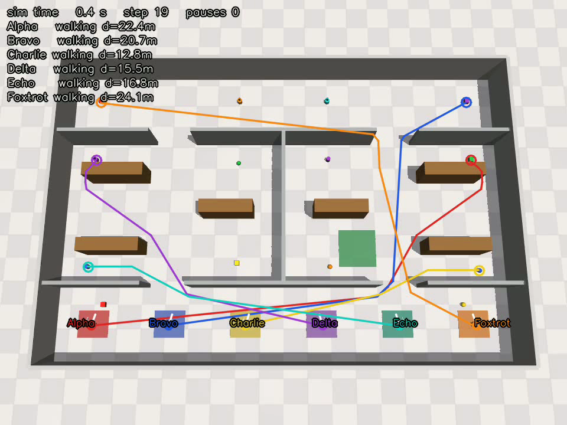](assets/gallery/six_fleet_nav.mp4) | [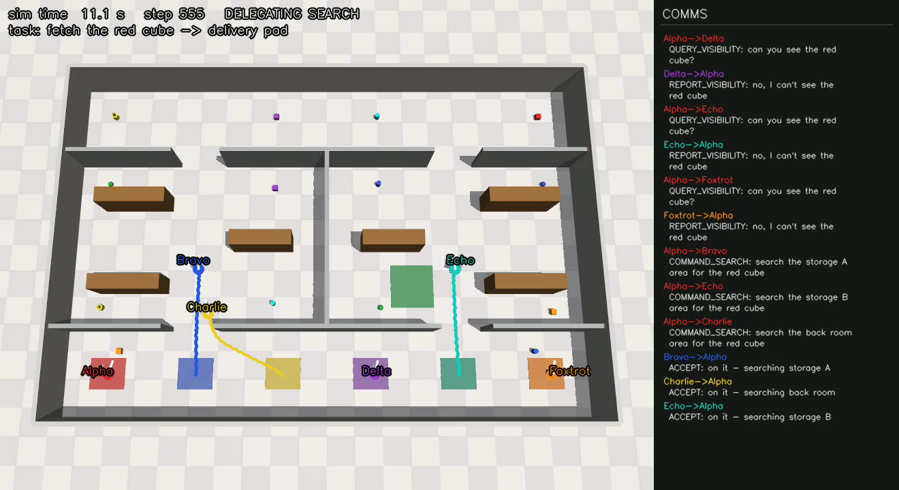](assets/gallery/six_mission_c.mp4) |
| **Six-robot fleet navigation** (rooms6, 24×16 m) — Alpha…Foxtrot leave six bays and cross the four-room hall on their own A\* routes through the doorways; mutual-proximity pauses fire; 6/6 arrive, zero falls. | **Six-robot collaborative search** (rooms6, class C) — Alpha queries all five peers, delegates three rooms to three searchers (two held in reserve), Charlie finds the cube in the back room and reports to Alpha, who fetches and delivers; live comms panel. |

<details>
<summary><b>Earlier milestones</b> — the original hero single-hall layout (teacher locomotion + oracle perception)</summary>

| | |
|---|---|
| [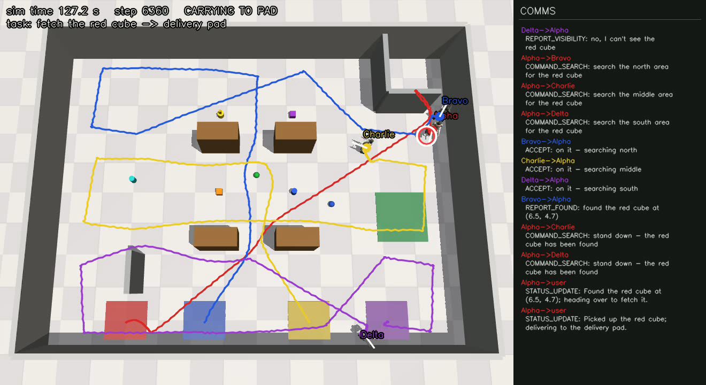](assets/gallery/mission_c.mp4) | [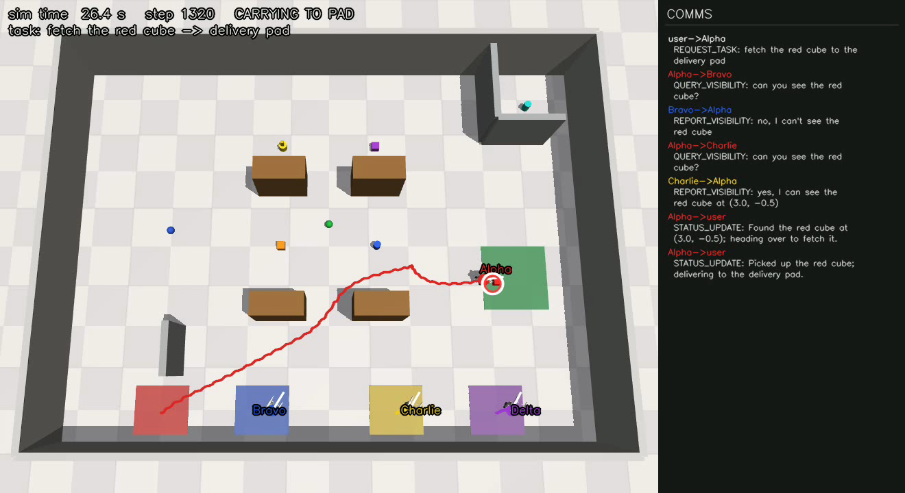](assets/gallery/mission_b.mp4) |
| **Collaborative search & fetch** (C) — hero layout, delegated north/middle/south band search. | **Peer visibility handoff** (B) — hero layout, addressed query → peer report → fetch. |
| [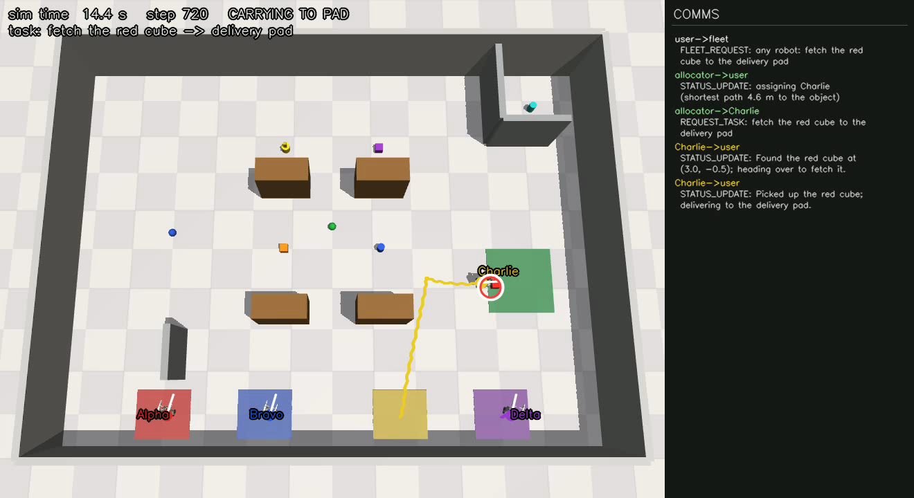](assets/gallery/allocator.mp4) | [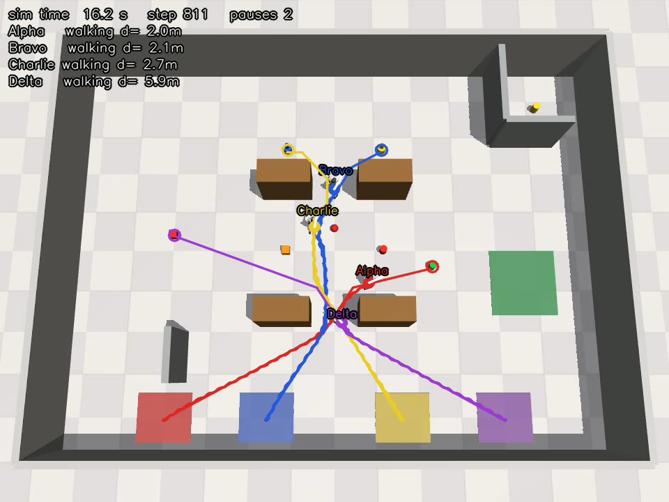](assets/gallery/fleet_nav.mp4) |
| **Task allocation** (D) — hero layout; allocator assigns the shortest-A\*-path robot. | **Fleet navigation** — hero layout, four robots crossing shared aisles, WBC-teacher gait. |

</details>

---

## How it works

Deep dive: **[docs/multi_plan.md](docs/multi_plan.md)** (architecture, decisions, phase
plan); final-demo requirements in **[docs/final_demo_spec.md](docs/final_demo_spec.md)**.

### Federated physics + one shared viz model
The single-robot baseline assumes the robot *is* the whole MuJoCo model (literal
`qpos[0:3]` pelvis slicing, a hardcoded `"pelvis"` body, a distilled walk policy tuned
against exactly that model). Rather than refactor and risk that gait, the fleet is
**federated**: each robot gets its **own** `MjModel`/`MjData`/`WBCTeacher` where it is
alone — so every line of baseline single-robot code stays valid verbatim. A **single
shared kinematic viz model** (`code.fleet.viz.FleetViz`) holds the warehouse plus all
four robots attached under name prefixes; it is never stepped — each frame every robot's
physics `qpos` is copied into its slice and `mj_forward` refreshes kinematics. That
shared model is what the fleet BEV video and the **cross-visibility** ego-camera renders
draw from, so robots genuinely see each other (~3% of Alpha's ego view when Bravo steps
in front — the `fleet_video` CLI prints this and saves before/after ego PNGs as proof).

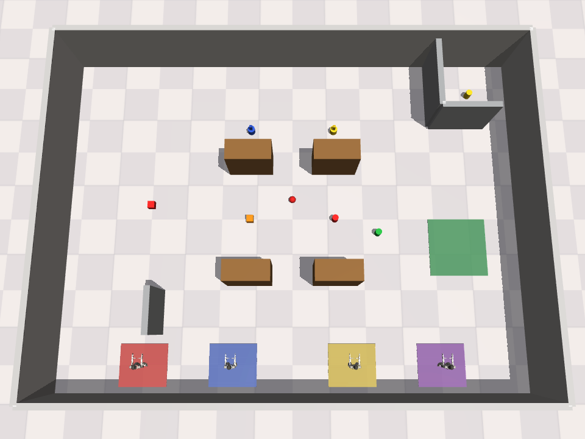

<sub>The hero single-hall layout (16×12 m; **retained for regression + component
evals**). The final demos run in the multi-room layout described below.</sub>

### Multi-room warehouse + room-aware search (F6)
The flagship layout (`rooms_layout()`) is a 20×14 m shell split into **four named
rooms** — **loading room** (south, four robot bays), **storage A** (west shelves),
**storage B** (east shelves + delivery pad) and **back room** (north) — connected by
four 2.0 m **open doorways** in a cycle (the storage A|B divider is solid, so A\* always
has a route choice). Objects are findable only by exploring room to room. Crucially the
**rooms are the single source of truth**: `layout.rooms` feeds the search partition, the
`COMMAND_SEARCH` region strings, **and** the spoken room name in every position report.
Reachability is a test gate (44/44 bay→spot pairs at 0.40 and 0.45 m inflation), and
patrols route through the doorways. The hero layout keeps its north/middle/south bands.

### Navigation: occupancy A\* → pure-pursuit → learned VLA gait
The warehouse **wall list is the single source of truth**: `code.warehouse.arena` turns
it into MJCF geoms and `code.warehouse.occupancy` rasterizes the *same* list into the
planner grid, so the simulated and planned worlds can never skew. `code.planner` runs an
8-connected, no-corner-cutting **A\*** (~22 ms on the hall grid), smooths it with
supercover line-of-sight, and follows it with **pure-pursuit** emitting `(v, ω)` velocity
commands. In the demos those commands drive the **fine-tuned VLA locomotion policy**
(ego-RGB + proprio + velocity conditioning → joint targets); the WBC teacher is confined
to generating the training data and to holding **standing balance** (idle / arrived /
proximity-pause steps — the policy walks, the WBC balances a static stand). Non-goal
objects are stamped into the grid as obstacles so paths never clip them.

### Learned perception: geometric occlusion gate + fine-tuned GROUND_NET confirmer
"Can you see it?" is answered by two cooperating parts. The geometric **oracle**
(`code.fleet.visibility`) is the **occlusion gate** — the physics truth of what a wall
blocks (exact FOV + range + line-of-sight). The **fine-tuned GROUND_NET detector** then
**confirms and localizes** a proposed sighting: it independently renders that robot's
grounding camera from the shared viz model and runs the query-conditioned heatmap on the
`(shape, color)`. Each robot owns its own `GroundNetState` (track hysteresis / heatmap
cache isolated per robot), while the detector *weights* are shared (one checkpoint load).
The **warehouse fine-tune** (below) recovers the detector's confidence on the grey
industrial floor — from 8.8% detection to 100%, confidence p50 0.243 → 0.894.

### Addressed comms with structural need-to-know + relative-position reports
`code.comms` is a synchronous, deterministic, per-recipient FIFO **message bus** carrying
typed FIPA-style performatives (`QUERY_VISIBILITY`, `REPORT_VISIBILITY`, `COMMAND_SEARCH`,
`ACCEPT`, `REPORT_FOUND`, `STATUS_UPDATE`, `TASK_COMPLETE`, …). **Need-to-know is
structural**, not a convention: a helper can only reply to the owner that addressed it
(`REPORT_FOUND` goes to the owner *only*), and only the task owner may message the user.
Position is always shared as a **fixed relative-position report** (F3): because each robot
knows its own pose exactly, the reporter states its room and pose and gives the object's
offset *relative to itself*; the receiver reconstructs the absolute position as
`reporter_pose + offset`. A real transcript from a multi-room mission C (owner = Alpha;
the cube is hidden from everyone, in storage A):

```text
user->Alpha       REQUEST_TASK:       fetch the red cube to the delivery pad
Alpha->Bravo      QUERY_VISIBILITY:   can you see the red cube?
Bravo->Alpha      REPORT_VISIBILITY:  no, I can't see the red cube
Alpha->Charlie    QUERY_VISIBILITY:   can you see the red cube?
Charlie->Alpha    REPORT_VISIBILITY:  no, I can't see the red cube
Alpha->Delta      QUERY_VISIBILITY:   can you see the red cube?
Delta->Alpha      REPORT_VISIBILITY:  no, I can't see the red cube
Alpha->Delta      COMMAND_SEARCH:     search the storage B area for the red cube
Alpha->Bravo      COMMAND_SEARCH:     search the storage A area for the red cube
Alpha->Charlie    COMMAND_SEARCH:     search the back room area for the red cube
Bravo->Alpha      ACCEPT:             on it — searching storage A
Charlie->Alpha    ACCEPT:             on it — searching back room
Delta->Alpha      ACCEPT:             on it — searching storage B
Bravo->Alpha      REPORT_FOUND:       I am robot Bravo, currently in storage A at position (-3.0, 2.3). The object is located -6.0 m and 0.3 m away from me.   # F3 report, peer -> owner ONLY
Alpha->Charlie    COMMAND_SEARCH:     stand down — the red cube has been found
Alpha->Delta      COMMAND_SEARCH:     stand down — the red cube has been found
Alpha->user       STATUS_UPDATE:      Found the red cube at (-9.0, 2.6); heading over to fetch it.   # = reporter (-3.0, 2.3) + offset (-6.0, 0.3)
Alpha->user       STATUS_UPDATE:      Picked up the red cube; delivering to the delivery pad.
Alpha->user       TASK_COMPLETE:      Delivered the red cube to the delivery pad.
```

### Region search + path-length allocator
When nobody sees the object, the owner partitions the space into the **named rooms**
(hero: north/middle/south bands) and commands one searcher per region; each patrols
reachable waypoints through doorways while polling the occlusion gate + detector, and the
first to see it reports back (the rest stand down). For a **fleet-addressed** order the
`allocator` computes each robot's actual A\* path length to the object (or, if unseen, to
its nearest search region) and assigns the **argmin** — provably the shortest-path robot.

Robot-robot conflicts are handled by a mutual-proximity pause (hysteresis, callsign
priority — zero falls everywhere). A full **space-time reservation planner**
(`code/planner/reserve.py`: time-expanded A\* with waits over a shared reservation
table) exists as a tested opt-in (`reservations=True`), but we measured it as a
behavioral no-op on these layouts (identical success/pauses/makespan over 10 OFF-vs-ON
trials at 4 and 6 robots) — the aisles are open enough that detours never beat
proceeding, and the pure-pursuit follower executes geometry, not schedules. So the
simple mechanism stays the default, with the measurement documented rather than the
fancier machinery oversold.

---

## Honest assumptions

> This is a **simulation-and-coordination** showcase with two real in-repo fine-tunes,
> not a manipulation result. The parts that are *stubbed* are stubbed behind the **same
> interfaces** the real components would use, and are called out here so nothing is oversold:
>
> - **Mock pickup, not grasping.** "Pick up" = when a robot is within reach radius, the
>   object is kinematically attached to its **right wrist link** (`right_wrist_yaw_link`)
>   and re-posed to the hand every control step until it is released on the pad. There is
>   **no grasp policy** and no contact/friction on the object.
> - **Occlusion is a geometric oracle gate.** *What a wall blocks* is decided by exact
>   FOV + range + line-of-sight geometry (`code.fleet.visibility`), not by learned
>   segmentation. The **fine-tuned GROUND_NET detector** then confirms and localizes the
>   sighting through that gate (Results reports its detection rate, xy error and confidence).
> - **Standing balance still uses the WBC.** The learned VLA policy *walks*; when a robot
>   holds a static stand (idle / arrived / proximity pause) the WBC controller keeps it
>   balanced (the policy is trained to walk, not to balance a static stand). The WBC is
>   otherwise used only to generate the DART training data.
> - **Robot–robot collisions are avoided, not simulated.** The four robots live in separate
>   physics models, so they cannot physically collide; overlap is prevented by planner
>   reservations + a mutual-proximity **pause** (lower-priority robot yields), not contact.
> - **Robot poses are known.** Each robot's own `(x, y, yaw)` is treated as exactly known
>   (a warehouse-localization assumption). **Object** poses are *not* known — an object must
>   actually be seen by a robot's camera/detector to be located.

---

## Results

Mission classes: **A** owner already sees the object → direct fetch · **B** only a peer
sees it → addressed query + handoff · **C** hidden from all → delegated region search ·
**D** fleet-addressed → allocator picks the shortest-path robot. Artifacts land in `eval/`.

### Full learned stack (multi-room + fine-tuned detector + VLA locomotion)

| Capability | Result | Detail |
|---|---|---|
| Search-and-fetch missions, class **C** (delegated room-to-room exploration) | **60/60** (20 seeds) | rooms layout, groundnet + VLA, 0 falls |
| Fleet allocator, class **D** (*"someone bring the object"*) | **3/3** optimal | matches an independent A\* argmin |
| Hero-layout regression (A/B/C + D) | **6/6 + 3/3** | unchanged by the learned stack |
| Falls across all **24** full-stack missions | **0** | rooms + hero |
| VLA locomotion nav gate | **30/30**, 0 falls | hero **20/20** (2 seeds) + rooms **10/10**, path eff ≥ 0.994 |
| VLA policy inference | **1.6–1.7 ms/step** | on GPU |

### Generalization — 384 missions on 16 never-seen randomized layouts

Both layout families have seeded samplers (`sample_layout`, `sample_rooms_layout`)
that self-validate and A\*-verify every bay→spot/pad pair at 0.40 **and** 0.45 m
inflation before any mission runs (`code/fleet/gen_eval.py`, 8 layouts × 3 mission
seeds × both stacks per family):

| Layout family (randomized) | Stack | Fetch success (A–C) | Allocator (D) | Falls |
|---|---|---|---|---|
| 4-room, 8 sampled layouts | full learned (fine-tuned detector + VLA) | **71/72 (98.6%)** | 24/24 | 0 |
| 4-room, 8 sampled layouts | oracle + teacher baseline | 72/72 | 24/24 | 0 |
| hero hall, 8 sampled layouts | full learned | **71/72 (98.6%)** | 24/24 | 1 |
| hero hall, 8 sampled layouts | oracle + teacher baseline | 72/72 | 24/24 | 0 |

The two learned-stack misses are isolated and diagnosed (one long-range
doorway-framed detector mislocalization at ~6.2 m; one walk-policy fall —
0.5% of learned missions), not systematic map failures.

### Warehouse GROUND_NET detector — before vs after the domain fine-tune

| Metric (on oracle-visible frames) | Playground checkpoint | Warehouse fine-tune |
|---|---|---|
| Detection rate | 8.8% | **100%** |
| World-xy localization error (p90) | 0.051 m | **0.037 m** |
| In-mission confirmation confidence (p50) | 0.243 | **0.894** |
| In-mission confirmations (0 through-wall hallucinations) | — | **3,675** |

### Component evals (hero layout, teacher locomotion + oracle)

| Capability | Result | Detail |
|---|---|---|
| Single-robot A\* warehouse nav (bay → occluded spot) | **10/10** (and **20/20** on a 2nd seed) | 0 falls, 0 wall hits, path efficiency **1.00** |
| 4-robot fleet nav (simultaneous, crossing aisles) | **5/5** all-arrive | 0 falls, mean makespan 1257 steps |
| Collaborative fetch missions A/B/C (10 seeds each) | **30/30** | 0 falls across every mission |
| Fleet allocator D | **3/3** optimal | matches an independent A\* argmin |
| Determinism | **byte-identical** | same-seed mission transcript reproduces exactly |

| Performance | Value |
|---|---|
| 4-robot headless mission step (physics + viz sync + protocol + VLA policy) | **1.7–2.2 ms** (50 Hz budget = 20 ms) |
| A\* plan | **~22 ms** on the 160×120 grid (0.1 m cells) |
| Cross-visibility signal | **~3.3%** of Alpha's ego view changes when Bravo stands ~2.5 m in front |
| Test suite | **≈1450 tests OK** (stdlib `unittest`) — a fresh clone runs **1449 OK, 11 skip** without the trained/optional checkpoints |

---

## Training the two in-repo fine-tunes

Both learned upgrades are reproducible from committed CLIs; the resulting checkpoints land
in **gitignored `runs/`** (see the ckpt-resolution note in [Quickstart](#checkpoint-auto-resolution--fresh-clone-fallback)).
All commands assume `export PYTHONPATH=.`.

### VLA locomotion (F5) — fine-tuned distilled walk policy
20-epoch fine-tune of the baseline distilled-walk **GroundedNav** policy (arch A, proprio
57, ego-RGB zeroed per the baseline lineage) on a warehouse-domain **DART** set — the WBC
teacher drives data collection only. Closed-loop checkpoint selection over 5 candidates
(epoch 19 chosen); val_action **0.0886 → 0.0612**. Dataset: **200 episodes / 125,683
frames** (133 A\*-routed + 67 primitive-command), 98.5% episode success.

```bash
# 1. datagen — teacher-driven DART rollouts along A* warehouse routes -> runs/warehouse_dart/<date>/
MUJOCO_GL=egl python -m code.apps.warehouse_datagen.gen_warehouse_dart \
    --episodes 200 --seed 7 --chunk-size 50 --out runs/warehouse_dart
# 2. fine-tune from the G1Nav baseline distilled-walk checkpoint -> runs/warehouse_dart_ft_A/
MUJOCO_GL=egl python code/train_dart_phase.py \
    --data runs/warehouse_dart --out runs/warehouse_dart_ft_A \
    --resume-ckpt <G1Nav-baseline>/runs/dart_phase_A/model_best.pt --reset-epoch \
    --epochs 20 --batch 64 --lr 3e-4
# 3. closed-loop gate (policy locomotion): hero 20/20 + rooms 10/10, 0 falls
MUJOCO_GL=egl python code/apps/warehouse_demo/nav_eval.py --n 10 --backend vla \
    --layout hero  --ckpt runs/warehouse_dart_ft_A/model_best.pt
MUJOCO_GL=egl python code/apps/warehouse_demo/nav_eval.py --n 10 --backend vla \
    --layout rooms --ckpt runs/warehouse_dart_ft_A/model_best.pt
```

### GROUND_NET detector — warehouse-domain fine-tune
Retrain the query-conditioned heatmap detector **from scratch** on a warehouse detector
set (baseline NX-6 recipe; no resume), best epoch 12. Dataset: **11,630 frames / 340
hero+rooms scenes**, trajectory + teleport camera sources, wall-occluded negatives from
segmentation labels.

```bash
# 1. datagen -> dataset/det_warehouse/
MUJOCO_GL=egl python -m code.apps.warehouse_datagen.gen_warehouse_det \
    --n-hero 210 --n-rooms 160 --seed 8100 --out dataset/det_warehouse
# 2. train from scratch (baseline detector recipe) -> runs/nx6_warehouse_ft/
MUJOCO_GL=egl python code/train_nx6_heatmap.py \
    --data dataset/det_warehouse --out runs/nx6_warehouse_ft --epochs 60 --batch 256
# 3. before/after eval (detection rate, xy error, confidence)
MUJOCO_GL=egl python code/fleet/perception_eval.py --seeds 4 \
    --ckpt runs/nx6_warehouse_ft/model_best.pt --out eval/perception/ft
```

---

## Quickstart

### Prerequisites

1. **Python 3.10 environment** with `requirements.txt` (same env as the baseline; see its
   [Environment Setup](https://github.com/KiwooShin/VLA_mujoco_unitree#environment-setup)).
2. **WBC walk teacher + G1 model** under `third_party/` — clone NVIDIA's Isaac-GR00T at the
   `n1.6.1-release` tag exactly as the baseline README documents:
   ```bash
   git clone --branch n1.6.1-release https://github.com/NVIDIA/Isaac-GR00T.git third_party/Isaac-GR00T
   pip install -e third_party/Isaac-GR00T --extra-index-url https://download.pytorch.org/whl/cu128
   ```
   (Used for DART data collection + standing balance; the demos walk on the trained VLA policy.)
3. **Baseline `GROUND_NET` detector** at `runs/nx6_heatmap_B/model_best.pt` — the fallback
   detector, used transparently whenever the warehouse fine-tune is absent (the warehouse
   detector is trained from scratch, so this is not a fine-tune starting point).

**External-assets step (fresh clones)** — symlink the two external dirs from your G1Nav
baseline checkout (they are gitignored here):
```bash
ln -s <G1Nav-baseline>/third_party third_party
mkdir -p runs && ln -s <G1Nav-baseline>/runs/nx6_heatmap_B runs/nx6_heatmap_B
```

Run everything from the repo root with `PYTHONPATH=.` (so the local `code` package isn't
shadowed) and `MUJOCO_GL=egl` (headless rendering; fallback `xvfb-run -a env MUJOCO_GL=glfw ...`).

### Checkpoint auto-resolution & fresh-clone fallback

The **two trained fine-tunes** land in gitignored `runs/warehouse_dart_ft_A/` (VLA) and
`runs/nx6_warehouse_ft/` (detector) and are therefore **absent in a fresh clone**. The
fleet CLIs auto-resolve checkpoints in this order:

- **Detector:** `GROUND_NET_CKPT` env → `runs/nx6_warehouse_ft/model_best.pt` → `runs/nx6_heatmap_B/model_best.pt`.
- **VLA policy:** `VLA_CKPT` env → `runs/warehouse_dart_ft_A/model_best.pt`.

**A fresh clone runs every demo in the default `--locomotion teacher` + `--perception
oracle` fallback** (no trained ckpts needed); `--perception groundnet` also works,
transparently falling back to the baseline detector. The learned upgrades — `--locomotion
vla` and the warehouse-fine-tuned `--perception groundnet` — activate once you either
**train the two checkpoints** (see [Training](#training-the-two-in-repo-fine-tunes)) or
point `VLA_CKPT` / `GROUND_NET_CKPT` at your own. Every command below is valid in both modes.

### Commands

```bash
export PYTHONPATH=.

# 1. Full test suite (~1450 tests; stdlib unittest, no extra deps)
MUJOCO_GL=egl python -m unittest discover -s code -p "test_*.py"

# 2. Collaborative fetch missions — hero A/B/C/D suite (teacher+oracle; ~3 min)
MUJOCO_GL=egl python code/fleet/mission_eval.py --seeds 10 --out eval/missions
#    …or a fast smoke (one seed per class + the allocator checks):
MUJOCO_GL=egl python code/fleet/mission_eval.py --seeds 1 --out eval/missions

# 3. Multi-room missions (teacher+oracle fallback — runs in a fresh clone)
MUJOCO_GL=egl python code/fleet/mission_eval.py --layout rooms --seeds 1 --out eval/missions_rooms

# 4. FULL LEARNED STACK — multi-room + fine-tuned detector + VLA locomotion
#    (needs the two trained ckpts; see Training / ckpt auto-resolution above)
MUJOCO_GL=egl python code/fleet/mission_eval.py --layout rooms \
    --perception groundnet --locomotion vla --seeds 1 --out eval/missions_fullstack

# 5. Flagship mission video (multi-room collaborative search-and-fetch) -> ops/rooms/
MUJOCO_GL=egl python code/fleet/mission_video.py --scenario C --layout rooms \
    --out ops/rooms --decimation 4
#    …full learned-stack render (with trained ckpts): add --perception groundnet --locomotion vla

# 6. Interactive web demo — type addressed commands, watch the fleet + transcript live
MUJOCO_GL=egl python -m code.apps.fleet_web --port 7799      # then open http://127.0.0.1:7799

# 7. Component evals (hero): single-robot A* nav (10/10) + 4-robot fleet nav (5/5) -> eval/
MUJOCO_GL=egl python code/apps/warehouse_demo/nav_eval.py --n 10 --seed 0
MUJOCO_GL=egl python code/fleet/fleet_eval.py --n 5 --seed 0

# 8. Fleet BEV video + cross-visibility proof -> ops/phase2/
MUJOCO_GL=egl python code/fleet/fleet_video.py --out ops/phase2
```

Rebuild the committed gallery clips/posters/GIF from the final recordings with
`python tools/build_gallery.py --final` (uses the `imageio-ffmpeg` bundled binary).

---

## Repository map

| Path | What |
|---|---|
| `code/warehouse/` | Layout spec (hero + `rooms_layout`, single source of truth), Room API, MJCF assembly, occupancy rasterizer |
| `code/planner/` | 8-connected A\*, line-of-sight smoothing, pure-pursuit follower |
| `code/comms/` | Typed addressed message bus, performatives, need-to-know protocol, F3 relative-position reports |
| `code/fleet/` | `RobotUnit` engine, `Fleet` co-sim, shared `FleetViz`, visibility oracle, learned-detector bridge, region search, carry, allocator, `MissionRunner`, `locomotion` (teacher\|vla); the `fleet_eval`/`fleet_video`/`mission_eval`/`mission_video`/`perception_eval` CLIs |
| `code/apps/warehouse_demo/` | Single-robot warehouse nav rollout + `nav_eval`/`nav_video` CLIs, `vla_backend`, wide BEV renderer |
| `code/apps/warehouse_datagen/` | Warehouse-domain DART + detector dataset generators (F5 datagen) |
| `code/apps/fleet_web/` | Interactive live web demo (MJPEG BEV, status chips, live transcript, command box) |
| `code/sim/ perception/ control/ policy/ data/ datagen/ train/ eval/ runtime/ apps/` | Inherited single-robot G1Nav baseline (distilled walk, grounding, two-camera perception) |
| `docs/multi_plan.md` · `docs/final_demo_spec.md` | Multi-robot architecture + phase record · final-demo (F1–F6) requirements |
| `tools/build_gallery.py` | Compress final/hero recordings → committed gallery MP4s / posters / GIF |
| `assets/gallery/` `figures/` | Committed demo media |

Each package carries a sibling `tests/` directory; discover from the `code/` root as in
command 1. Created at runtime and **gitignored**: `eval/`, `runs/`, `ops/`, `dataset/`,
`checkpoint/`, `*.mp4` (except the committed `assets/gallery/*.mp4`). External and **not
committed**: `third_party/` (WBC + G1 model), `runs/nx6_heatmap_B/` (baseline detector);
the two domain fine-tunes are produced by the [Training](#training-the-two-in-repo-fine-tunes)
commands.

---

## Lineage, license & attribution

- **Baseline.** This project builds on the single-robot **[G1Nav VLA](https://github.com/KiwooShin/VLA_mujoco_unitree)**
  — a from-scratch Vision-Language-Action policy for a Unitree G1 (distilled WBC walk,
  learned grounding detector, DART recovery data, two-camera perception). The distilled
  walk policy and perception stack are the starting points for the **two warehouse-domain
  fine-tunes** here; the warehouse, multi-room layout, planner, fleet co-sim, and comms +
  mission layers are new.
- **GROUND_NET attribution.** The only pretrained weights in the lineage are NVIDIA's
  **GR00T-N1.6** (frozen language model, training-time only in the baseline) and the
  **GR00T-WholeBodyControl** walk ONNX teacher + G1 MuJoCo model, from NVIDIA's
  [Isaac-GR00T](https://github.com/NVIDIA/Isaac-GR00T) (`n1.6.1-release`). Obtain them per
  the baseline README; they are not redistributed here.
- **License.** MIT — see [LICENSE](LICENSE).
