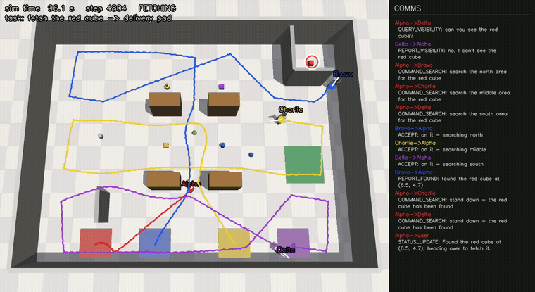

# Multi-Robot Warehouse — 4 Unitree G1 Humanoids, Collaborative Search-and-Fetch

Four named **Unitree G1 humanoids** — **Alpha, Bravo, Charlie, Delta** — share one
occluded warehouse where shelves and partitions hide most objects from any single
viewpoint. Give a robot a job in plain English ("*Alpha, fetch the red cube to the
delivery pad*") and it runs the whole collaboration itself: it checks its own view,
**addresses** teammates to ask what they can see, **delegates** a region search when
nobody can, receives the location over a **need-to-know** message bus, plans the
**shortest collision-free A\*** route, walks it on a distilled whole-body-control gait,
picks up the object and delivers it — reporting milestones back to whoever asked, and
to no one else. A fleet-addressed order ("*someone bring me the red cube*") is instead
routed by an **allocator** that picks the robot with the objectively shortest path.

This builds directly on the single-robot [G1Nav baseline](https://github.com/KiwooShin/VLA_mujoco_unitree)
(distilled WBC walk policy, learned grounding, two-camera perception) and adds the
warehouse, the planner, the fleet co-simulation, and the addressed-comms + mission layer.


<sub>Bird's-eye of the hero warehouse: two split shelf rows form three aisles plus a
crossover; the NE **L-shaped alcove** and the SW partition hide objects from the hall;
the green pad is the delivery destination; the four colored floor bays are the robots'
home positions (Alpha red, Bravo blue, Charlie yellow, Delta purple).</sub>

### Collaborative fetch, end to end (mission C — object hidden from everyone)



<sub>The requested cube is hidden in the NE alcove, so **Alpha delegates**: Bravo/Charlie/Delta
search north/middle/south. Bravo finds it and reports the location **to Alpha only**;
Alpha stands the others down, walks the long red diagonal to fetch it, and carries it to
the pad. The right panel is the **live comms transcript**, colored per speaker.
(GitHub can't autoplay committed MP4s — this is a compressed clip of the full video below.)</sub>

## Demo gallery

Click a poster to play the MP4 (`assets/gallery/`). All four are one continuous render from the shared fleet viz model.

| | |
|---|---|
| [](assets/gallery/mission_c.mp4) | [](assets/gallery/mission_b.mp4) |
| **Collaborative search & fetch** (C) — object hidden from all; delegated region search, finder reports to the owner, owner delivers. | **Peer visibility handoff** (B) — only a teammate can see the object; addressed query → the peer reports the location → owner fetches. |
| [](assets/gallery/allocator.mp4) | [](assets/gallery/fleet_nav.mp4) |
| **Task allocation** (D) — a fleet-addressed order; the allocator assigns the shortest-A\*-path robot (Charlie, 4.6 m) and it executes. | **Fleet navigation** — four robots cross shared aisles simultaneously, each on its own A\* route, with mutual-proximity pauses; zero falls. |

**One-file reel** (all four segments behind title cards): [`assets/gallery/hero_reel.mp4`](assets/gallery/hero_reel.mp4).

---

## How it works

Deep dive: **[docs/multi_plan.md](docs/multi_plan.md)** (architecture, decisions, phase plan).

### Federated physics + one shared viz model
The single-robot baseline assumes the robot *is* the whole MuJoCo model (literal `qpos[0:3]`
pelvis slicing, a hardcoded `"pelvis"` body, a fragile distilled walk policy tuned against
exactly that model). Rather than refactor and risk that gait, the fleet is **federated**:
each robot gets its **own** `MjModel`/`MjData`/`WBCTeacher` where it is alone — so every line
of baseline single-robot code stays valid verbatim. A **single shared kinematic viz model**
(`code.fleet.viz.FleetViz`) holds the warehouse plus all four robots attached under name
prefixes; it is never stepped — each frame every robot's physics `qpos` is copied into its
slice and `mj_forward` refreshes kinematics. That shared model is what the fleet BEV video and
the **cross-visibility** ego-camera renders draw from, so robots genuinely see each other
(measured: Bravo occupies **~3%** of Alpha's ego view when he steps ~2.5 m in front — the
`fleet_video` CLI prints this and saves the before/after ego PNGs as proof).

### Navigation: occupancy A\* → pure-pursuit → WBC velocity walking
The warehouse **wall list is the single source of truth**: `code.warehouse.arena` turns it into
MJCF geoms and `code.warehouse.occupancy` rasterizes the *same* list into the planner grid, so
the simulated world and the planning world can never skew. `code.planner` runs an 8-connected,
no-corner-cutting **A\*** (~22 ms on the 160×120 hall grid), smooths it with supercover
line-of-sight, and follows it with **pure-pursuit** that emits `(v, ω)` velocity commands —
which the baseline **WBC walk teacher** turns into the 15-DoF gait. Non-goal objects are stamped
into the grid as obstacles so paths never clip them.

### Addressed comms with structural need-to-know
`code.comms` is a synchronous, deterministic, per-recipient FIFO **message bus** carrying typed
FIPA-style performatives (`QUERY_VISIBILITY`, `REPORT_VISIBILITY`, `COMMAND_SEARCH`, `ACCEPT`,
`REPORT_FOUND`, `STATUS_UPDATE`, `TASK_COMPLETE`, …). **Need-to-know is structural**, not a
convention: a helper robot can only reply to the owner that addressed it (`REPORT_FOUND` goes to
the owner *only*), and only the task owner is allowed to message the user. A real transcript from
mission C (owner = Alpha; the cube is hidden from everyone):

```text
user->Alpha       REQUEST_TASK:       fetch the red cube to the delivery pad
Alpha->Bravo      QUERY_VISIBILITY:   can you see the red cube?
Bravo->Alpha      REPORT_VISIBILITY:  no, I can't see the red cube
Alpha->Charlie    QUERY_VISIBILITY:   can you see the red cube?
Charlie->Alpha    REPORT_VISIBILITY:  no, I can't see the red cube
Alpha->Delta      QUERY_VISIBILITY:   can you see the red cube?
Delta->Alpha      REPORT_VISIBILITY:  no, I can't see the red cube
Alpha->Bravo      COMMAND_SEARCH:     search the north area for the red cube
Alpha->Charlie    COMMAND_SEARCH:     search the middle area for the red cube
Alpha->Delta      COMMAND_SEARCH:     search the south area for the red cube
Bravo->Alpha      ACCEPT:             on it — searching north
Charlie->Alpha    ACCEPT:             on it — searching middle
Delta->Alpha      ACCEPT:             on it — searching south
Bravo->Alpha      REPORT_FOUND:       found the red cube at (6.5, 4.7)   # peer -> owner ONLY
Alpha->Charlie    COMMAND_SEARCH:     stand down — the red cube has been found
Alpha->Delta      COMMAND_SEARCH:     stand down — the red cube has been found
Alpha->user       STATUS_UPDATE:      Found the red cube at (6.5, 4.7); heading over to fetch it.
Alpha->user       STATUS_UPDATE:      Picked up the red cube; delivering to the delivery pad.
Alpha->user       TASK_COMPLETE:      Delivered the red cube to the delivery pad.
```

### Region search + path-length allocator
When nobody can see the object, the owner partitions the hall into **north/middle/south** bands
and commands one searcher per band; each patrols reachable waypoints while polling the visibility
oracle, and the first to see it reports back (the rest stand down). For a **fleet-addressed**
order the `allocator` computes each robot's actual A\* path length to the object (or, if unseen,
to its nearest search region) and assigns the **argmin** — provably the shortest-path robot.

---

## Honest assumptions

> This is a **simulation-and-coordination** showcase, not a manipulation or perception-from-scratch
> result. The hard parts that are *stubbed* are stubbed behind the **same interfaces** the real
> components would use, and are called out here so nothing below is oversold:
>
> - **Mock pickup, not grasping.** "Pick up" = when a robot is within reach radius, the object is
>   kinematically attached to its **right wrist link** (`right_wrist_yaw_link`) and re-posed to the
>   hand every control step until it is released on the pad. There is **no grasp policy** and no
>   contact/friction on the object.
> - **Geometric visibility oracle, not a detector.** "Can you see it?" is answered by an exact
>   FOV + range + wall line-of-sight test (`code.fleet.visibility`), standing in for a perception
>   detector **behind the same `can_see` interface**. The baseline's learned `GROUND_NET` detector
>   ships in this repo and remains the drop-in for that interface.
> - **Robot–robot collisions are avoided, not simulated.** The four robots live in separate physics
>   models, so they cannot physically collide; overlap is prevented by planner reservations + a
>   mutual-proximity **pause** (lower-priority robot yields), not by contact physics.
> - **Robot poses are known.** Each robot's own `(x, y, yaw)` is treated as exactly known (a
>   warehouse-localization assumption). **Object** poses are *not* known — an object must actually be
>   seen by a robot's camera/oracle to be located.

---

## Results

All numbers are from the released run on the fixed hero layout; artifacts land in `eval/`.
Mission classes: **A** owner already sees the object → direct fetch · **B** only a peer sees it →
addressed query + handoff · **C** hidden from all → delegated region search · **D** fleet-addressed →
allocator picks the shortest-path robot.

| Capability | Result | Detail |
|---|---|---|
| Single-robot A\* warehouse nav (bay → occluded spot) | **10/10** (and **20/20** on a 2nd seed) | 0 falls, 0 wall hits, path efficiency **1.00**, min clearance 0.24 m |
| 4-robot fleet nav (simultaneous, crossing aisles) | **5/5** all-arrive | 0 falls, mean makespan 1257 steps, aisle pauses honored |
| Collaborative fetch missions A/B/C (10 seeds each) | **30/30** | 0 falls across every mission |
| Fleet allocator D ("someone bring me X") | **3/3** optimal | matches an independent A\* argmin over all robots |
| Determinism | **byte-identical** | same-seed mission-C transcript reproduces exactly (6,700 steps) |

| Performance | Value |
|---|---|
| 4-robot headless step (physics + viz sync + protocol) | **2.2–3.1 ms** (50 Hz budget = 20 ms) |
| A\* plan | **~22 ms** on the 160×120 grid (0.1 m cells) |
| Flagship mission video render | **~55 s** |
| Cross-visibility signal | **~3.3%** of Alpha's ego view changes when Bravo stands ~2.5 m in front (robots see each other) |
| Test suite | **1327 tests OK** (stdlib `unittest`, a few skip without external assets) |

---

## Quickstart

### Prerequisites

1. **Python 3.10 environment** with `requirements.txt` (same env as the baseline; see its
   [Environment Setup](https://github.com/KiwooShin/VLA_mujoco_unitree#environment-setup)).
2. **WBC walk teacher + G1 model** under `third_party/` — clone NVIDIA's Isaac-GR00T at the
   `n1.6.1-release` tag exactly as the baseline README documents:
   ```bash
   git clone --branch n1.6.1-release https://github.com/NVIDIA/Isaac-GR00T.git third_party/Isaac-GR00T
   pip install -e third_party/Isaac-GR00T --extra-index-url https://download.pytorch.org/whl/cu128
   ```
   The warehouse/fleet/mission commands use only the WBC walk ONNX + the G1 MuJoCo XML from
   this checkout — **not** the 6 GB GR00T-N1.6 language checkpoint or the `GROUND_NET` detector
   (those belong to the inherited single-robot VLA stack and are **optional** here).
3. *(Optional)* the `GROUND_NET` detector checkpoint at `runs/nx6_heatmap_B/model_best.pt` and the
   GR00T-N1.6-3B LM — only needed if you also run the inherited single-robot VLA pipeline.

Run everything from the repo root with `PYTHONPATH=.` (so the local `code` package isn't shadowed)
and `MUJOCO_GL=egl` (headless rendering; fallback `xvfb-run -a env MUJOCO_GL=glfw ...`).

### Commands

```bash
export PYTHONPATH=.

# 1. Full test suite (~1327 tests; stdlib unittest, no extra deps)
MUJOCO_GL=egl python -m unittest discover -s code -p "test_*.py"

# 2. Collaborative fetch missions — full A/B/C/D suite (30/30 A-C, 3/3 allocator; ~3 min)
MUJOCO_GL=egl python code/fleet/mission_eval.py --seeds 10 --out eval/missions
#    …or a fast smoke (one seed per class + the 3 allocator checks):
MUJOCO_GL=egl python code/fleet/mission_eval.py --seeds 1 --out eval/missions

# 3. Flagship mission video (the collaborative search-and-fetch story) -> ops/phase4/mission_C.mp4
MUJOCO_GL=egl python code/fleet/mission_video.py --scenario C --out ops/phase4 --decimation 4

# 4. Fleet BEV video + cross-visibility proof -> ops/phase2/
MUJOCO_GL=egl python code/fleet/fleet_video.py --out ops/phase2

# 5. Single-robot warehouse A* nav eval (10/10) -> eval/warehouse_nav/
MUJOCO_GL=egl python code/apps/warehouse_demo/nav_eval.py --n 10 --seed 0

# 6. 4-robot fleet nav eval (5/5 all-arrive, 0 falls) -> eval/fleet_nav/
MUJOCO_GL=egl python code/fleet/fleet_eval.py --n 5 --seed 0
```

Rebuild the committed gallery clips/posters/GIF from raw hero recordings with
`python tools/build_gallery.py` (uses the `imageio-ffmpeg` bundled binary).

---

## Repository map

| Path | What |
|---|---|
| `code/warehouse/` | Layout spec (single source of truth), MJCF assembly, occupancy rasterizer |
| `code/planner/` | 8-connected A\*, line-of-sight smoothing, pure-pursuit follower |
| `code/comms/` | Typed addressed message bus, performatives, need-to-know protocol state machine |
| `code/fleet/` | `RobotUnit` engine, `Fleet` co-sim, shared `FleetViz`, visibility oracle, region search, carry, allocator, `MissionRunner`; the `fleet_eval`/`fleet_video`/`mission_eval`/`mission_video` CLIs |
| `code/apps/warehouse_demo/` | Single-robot warehouse nav rollout + `nav_eval`/`nav_video` CLIs, wide BEV renderer |
| `code/sim/ perception/ control/ policy/ data/ datagen/ train/ eval/ runtime/ apps/` | Inherited single-robot G1Nav baseline (distilled WBC walk, grounding, two-camera perception) |
| `docs/multi_plan.md` | Multi-robot architecture plan + phase record |
| `docs/` | Baseline experiment ledger (start at [docs/INDEX.md](docs/INDEX.md)) |
| `tools/build_gallery.py` | Compress hero recordings → committed gallery MP4s / posters / GIF |
| `assets/gallery/` `figures/` | Committed demo media |

Each package carries a sibling `tests/` directory; discover from the `code/` root as in command 1.
Created at runtime and **gitignored**: `eval/`, `runs/`, `ops/`, `dataset/`, `checkpoint/`, `*.mp4`.
External and **not committed**: `third_party/` (WBC + G1 model), `runs/nx6_heatmap_B/` (optional detector).

---

## Lineage, license & attribution

- **Baseline.** This project builds on the single-robot **[G1Nav VLA](https://github.com/KiwooShin/VLA_mujoco_unitree)**
  — a from-scratch Vision-Language-Action policy for a Unitree G1 (distilled WBC walk, learned
  grounding detector, DART recovery data, two-camera perception). The distilled walk policy and
  perception stack are reused here unchanged; the warehouse, planner, fleet co-sim, and comms +
  mission layers are new.
- **GR00T attribution.** The only pretrained weights in the lineage are NVIDIA's **GR00T-N1.6**
  (frozen language model, training-time only in the baseline) and the **GR00T-WholeBodyControl**
  walk ONNX teacher + G1 MuJoCo model, from NVIDIA's [Isaac-GR00T](https://github.com/NVIDIA/Isaac-GR00T)
  (`n1.6.1-release`). Obtain them per the baseline README; they are not redistributed here.
- **License.** MIT — see [LICENSE](LICENSE).
