# Demo Set v2

Six production demos of the multi-room collaborative fetch fleet, each on the full learned stack (GROUND_NET perception + VLA locomotion) unless noted, with **random robot start poses**, an **always-on ego-camera strip**, a **live comms transcript**, and **clarification dialogue** for ambiguous orders. Click a poster to play the MP4; the GIF previews the story-dense window inline.

| Demo | Preview |
|------|---------|
| **Ambiguous Order -> Clarify -> Fetch**<br/>"Alpha, bring me the cube" is ambiguous — the warehouse manifest holds a red, a blue and a yellow cube. Alpha does not guess: it asks the user which cube is meant, waits for the answer ("the red one"), then delegates a room-to-room search for the red cube and delivers it to the pad.<br/><br/>[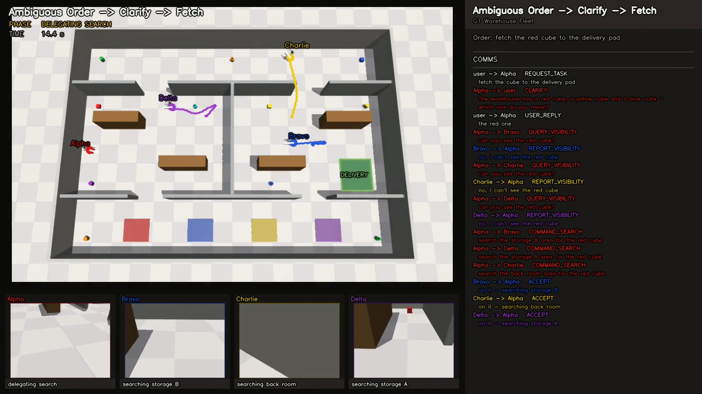](clarify_fetch.mp4) | 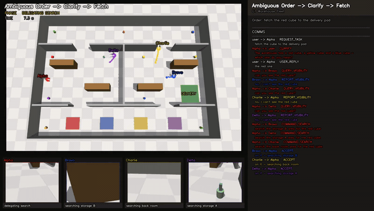 |
| **Exploration on a Never-Seen Map**<br/>A warehouse the fleet has never seen — layout, doorways, shelves, object spots and delivery pad are all freshly sampled. From random start poses the owner delegates a room-to-room search for a red cube hidden in a shelf-occluded corner, receives the relative-position report, and fetches it.<br/><br/>[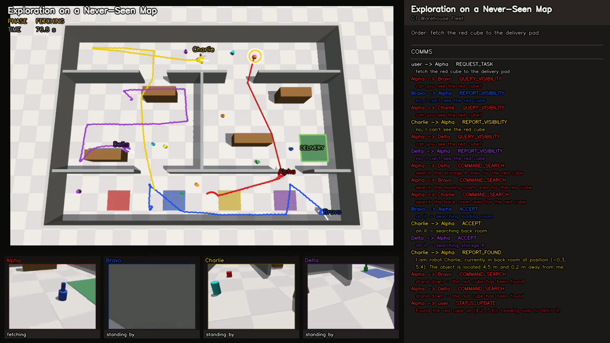](unseen_map.mp4) | 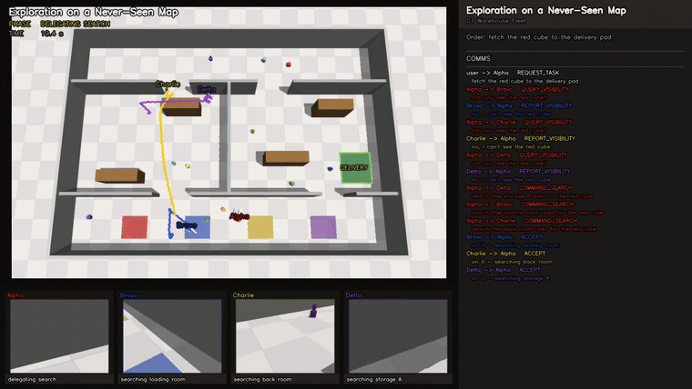 |
| **Two Objects, Two Owners, In Parallel**<br/>One order, two objects: "bring the red cube and the blue ball to the delivery pad" splits into two concurrent missions with two different owners working in parallel. Each ring is coloured for its owner; the run finishes only when both objects are on the pad.<br/><br/>[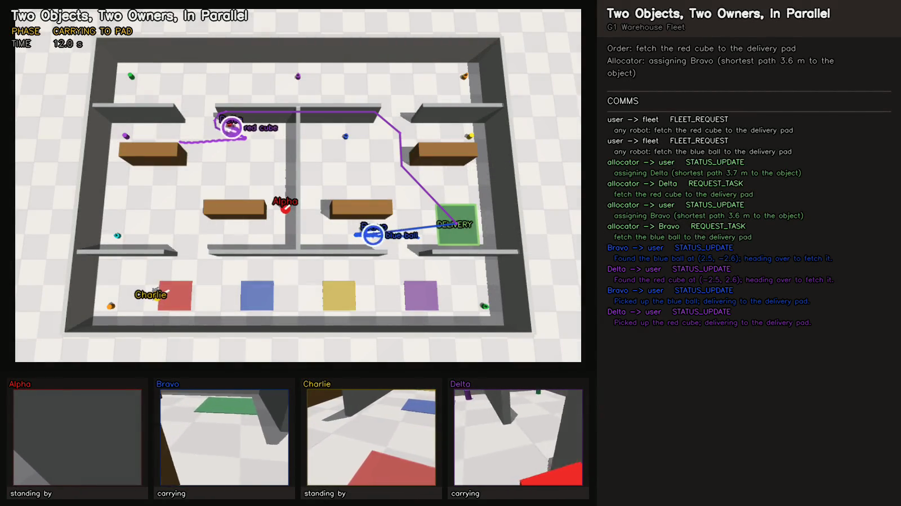](dual_fetch.mp4) | 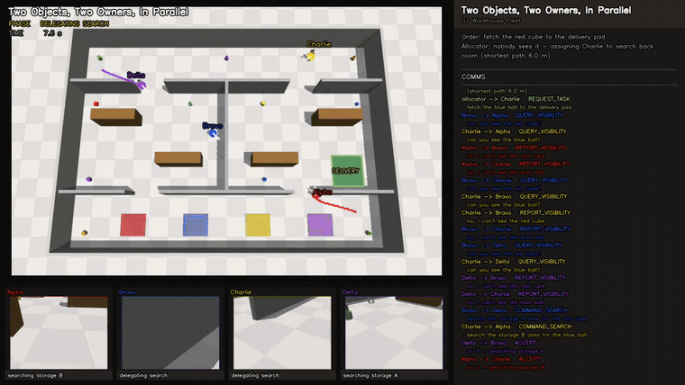 |
| **Sequential Relay: Two Legs, One Owner**<br/>A sequential relay on a second never-seen layout: one owner fetches the red cube first, then re-tasks the same teammates to search for the blue ball, delivering both in order. One TASK_COMPLETE, reported after the final leg.<br/><br/>[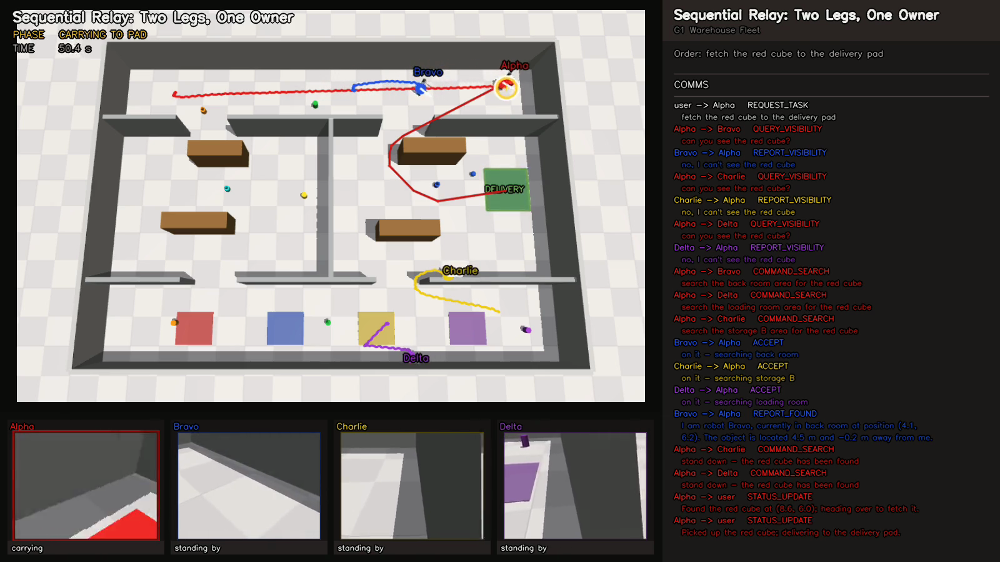](relay_multigoal.mp4) | 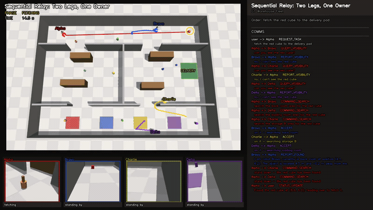 |
| **Mid-Mission Re-Task**<br/>The order changes mid-mission. Alpha is fetching the red cube when the user says "actually, bring me the yellow ball instead". Alpha stands down its helpers, drops the abandoned approach, and re-delegates a search for the ball — the old target ring clears and a new one appears.<br/><br/>[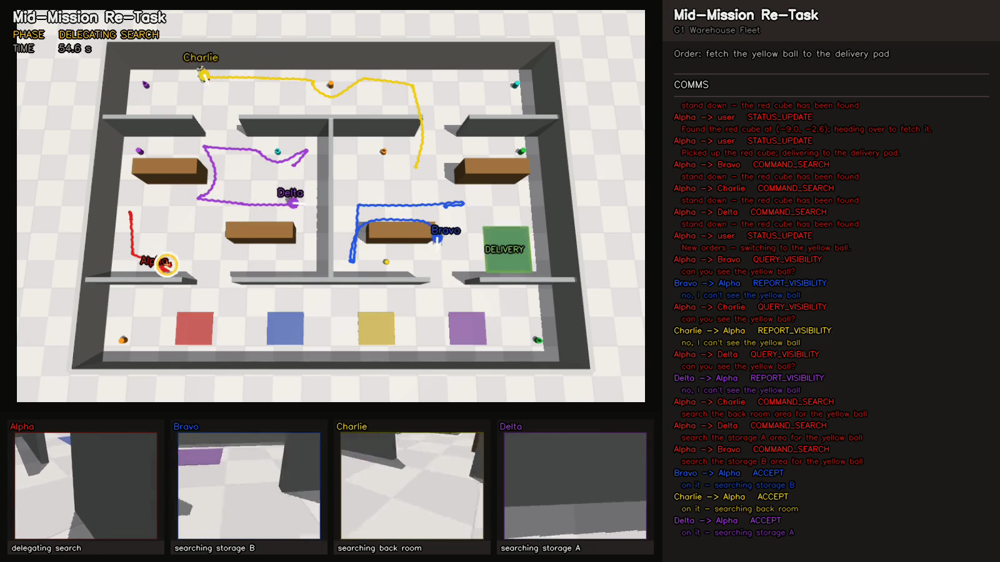](retask.mp4) | 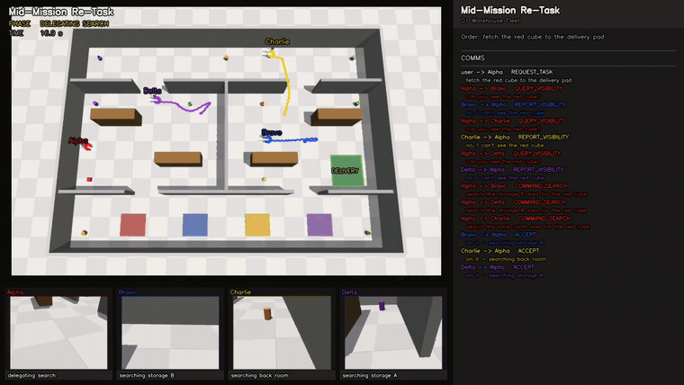 |
| **Six-Robot Flagship: Clarify, then Search**<br/>The flagship: six humanoids (Alpha..Foxtrot) in the big 24x16 m four-room hall. A fleet-addressed "someone bring me a ball" is ambiguous (red, green, blue), so the allocator clarifies, then assigns the shortest-path owner, which delegates the four rooms to four searchers with the sixth teammate held back in reserve, and delivers.<br/><br/>[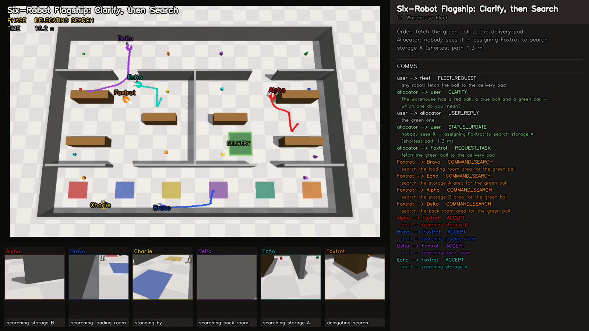](six_robot_flagship.mp4) | 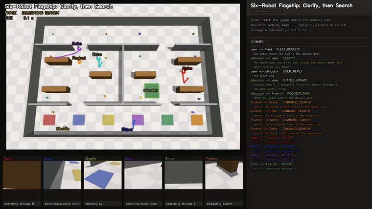 |

## Reproduce

```bash
PYTHONPATH=. MUJOCO_GL=egl \
  python -m code.apps.demos.scenarios.produce_all --all
```

Each demo is a deterministic `code.apps.demos.scenarios.Scenario` (seeded layout, spawns, objects, order and any clarify/re-task schedule); `--only <name>` produces a single demo.
